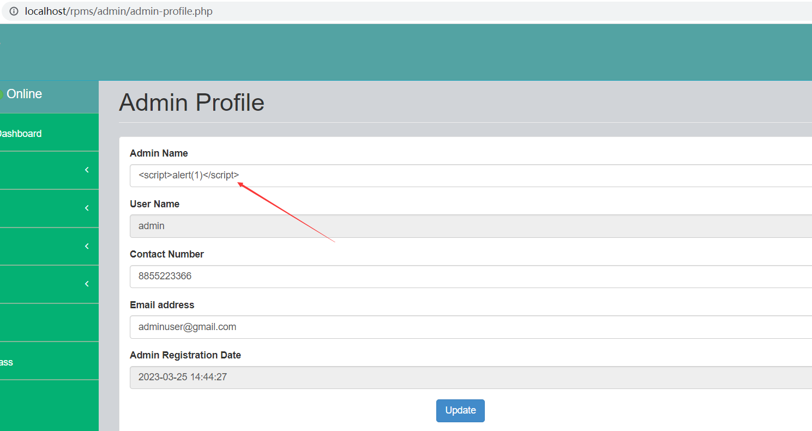
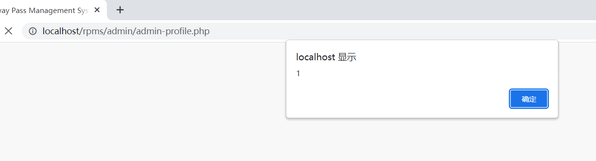

# [Rail Pass Management System-Stored XSS-admin-profile.php]

## Basic Information

**[Bug Reporter]:** DiliLearngent

**[Application Vendors]:** `https://phpgurukul.com/rail-pass-management-system-using-php-and-mysql/`

**[Test Environment]:** windows10+apache+php5.6+mysql5.5

**[Install]:**

1. Download the zip file

2. Extract the file and copy `rpms` folder

3. Paste inside root directory(for xampp xampp/htdocs, for wamp wamp/www, for lamp var/www/HTML)

4. Open PHPMyAdmin (http://localhost/phpmyadmin)

5. Create a database with the name `rpmsdb`

6. Import `rpmsdb.sql` file(given inside the zip package in the SQL file folder)

7. Run the script `http://localhost/rpms`

**Credential for Admin panel :**

**Username:** admin
**Password:** Test@123

## Bug Information

**[Vulnerability type]:** Stored XSS

**[Vulnerability Url]:** `http://localhost/rpms/admin/admin-profile.php`

**[Vulnerability Location]:** rpms/admin/admin-profile.php

**[Vulnerability Test]:**

1. Find the function point to change the line Admin Profile and insert the XSS payload in **"Admin Name"**.

   

2. After clicking the Update button, the update is successful and the XSS payload is successfully stored in the database.

3. Visit other pages, such as `http://localhost/rpms/admin/add-profile.php`, and a pop-up window appears.

   

**[code analysis]:**

rpms/admin/admin-profile.php

```php
if(isset($_POST['submit']))
{
    $adminid=$_SESSION['bpmsaid'];
    $AName=$_POST['adminname'];
    $mobno=$_POST['mobilenumber'];
    $email=$_POST['email'];
    $sql="update tbladmin set AdminName=:adminname,MobileNumber=:mobilenumber,Email=:email where ID=:aid";
    $query = $dbh->prepare($sql);
    $query->bindParam(':adminname',$AName,PDO::PARAM_STR);
    $query->bindParam(':email',$email,PDO::PARAM_STR);
    $query->bindParam(':mobilenumber',$mobno,PDO::PARAM_STR);
    $query->bindParam(':aid',$adminid,PDO::PARAM_STR);
    $query->execute();
    echo '<script>alert("Profile has been updated.")</script>';


}
```

When the **adminname** parameter value in the POST is obtained, it is stored in the database without any filtering, resulting in stored XSS.

```php+HTML
<div class="form-group"> <label for="exampleInputEmail1">Admin Name</label> <input type="text" name="adminname" value="<?php  echo $row->AdminName;?>" class="form-control" required='true'> </div>
```

And the output is made in the page.