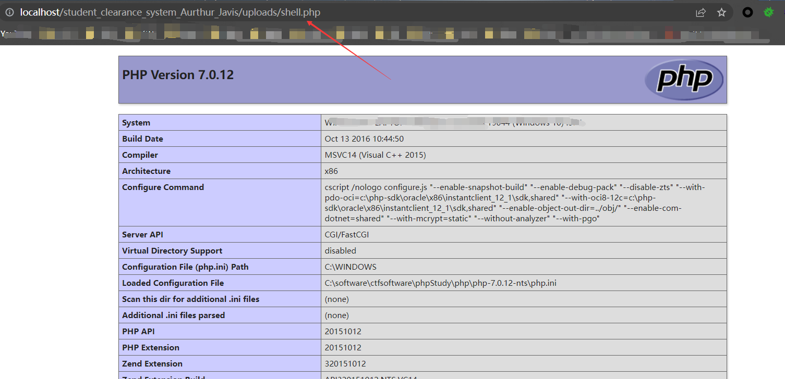

# [Web-Based Student Clearance System in PHP Free Source Code-File upload vulnerabilities-edit-photo.php]

## Basic Information

**[Bug Reporter]:** DililLearngent

**[Application Vendors]:** https://www.sourcecodester.com/php/15627/web-based-student-clearance-system.html

**[Test Environment]:** windows10+apache+php7.0

**[Install]:**

1. start **Apache** and **MySQL**.

2. **Extract** the downloaded source code **zip** file.

3. **Copy** the extracted source code folder and **paste** it into the **www directory**.

4. **Create** a **new database** naming **student_clearance**.

5. **Import** the provided **SQL** file. The file is known as **student_clearance.sql** located inside the **db** folder.

6. **Browse** the **Student Clearance System** in a **browser**. 

   i.e. **http://localhost/student_clearance_system_Aurthur_Javis/** for students 

   and **http://localhost/student_clearance_system_Aurthur_Javis/admin** for the admin panel.

   Admin Login：Username: **admin**      Password: **admin123**

## Bug Information

**[Vulnerability type]:** File upload vulnerabilities

**[Vulnerability Url]:** http://10.151.223.237/student_clearance_system_Aurthur_Javis/edit-photo.php

**[Vulnerability Location]:** student_clearance_system_Aurthur_Javis/edit-photo.php

**[Vulnerability Test]:**

1. First register a student account, use this account to log in on the student login interface

2. After the login is successful, find the operation interface for editing photo

   

3. Upload a php suffix file and capture the package

   

4. Access the path after uploading the avatar:http://localhost/student_clearance_system_Aurthur_Javis/uploads/shell.php

   

5. In the same way, if you upload a sentence Trojan horse, you can get the shell

**[code analysis]:**

In student_clearance_system_Aurthur_Javis/edit-photo.php:

```php
if(isset($_POST["btnedit"]))
{

    $image= addslashes(file_get_contents($_FILES['userImage']['tmp_name']));
    $image_name= addslashes($_FILES['userImage']['name']);
    $image_size= getimagesize($_FILES['userImage']['tmp_name']);
    move_uploaded_file($_FILES["userImage"]["tmp_name"],"uploads/" . $_FILES["userImage"]["name"]);			
    $location="uploads/" . $_FILES["userImage"]["name"];

    $sql = " update students set photo='$location' where matric_no='$matric_no'";
   
   if (mysqli_query($conn, $sql)) {

        header("Location: edit-photo.php");
    }else{
		$_SESSION['error']='Editing Was Not Successful';
	}
}
```

No filtering is done on uploaded filenames

```php+HTML
<div class="dropdown profile-element"> 
    <span>
		" alt="image" width="142" height="153" class="img-circle" />
    </span>
  
   
	<a data-toggle="dropdown" class="dropdown-toggle" href="#">
        <span class="clear">
            <span class="text-muted text-xs block">Matric No: <?php echo $rowaccess['matric_no'];  ?> <b class="caret"></b>
            </span> 
        </span> 
    </a>
    <ul class="dropdown-menu animated fadeInRight m-t-xs">

        <li><a href="logout.php">Logout</a></li>
    </ul>
</div>
```

And the file address is echoed on the page

